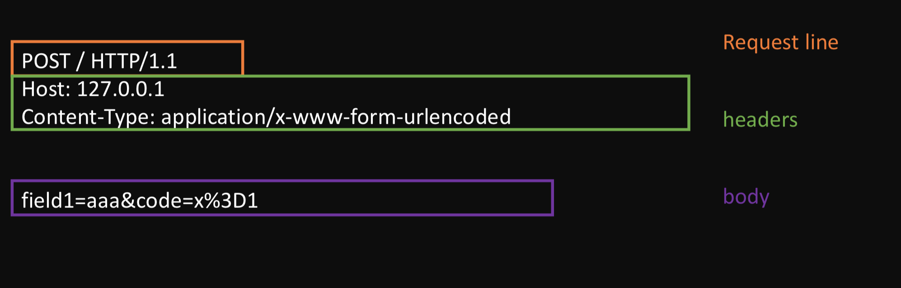

## Realm

realm在词典上的意思译为领域，可以这么类比的想想。一个realm就是一个小宇宙，每个小宇宙之间的任何事物都是不相等的。

### realm中所有的内置对象

```js
let objects = [
  "eval",
  "isFinite",
  "isNaN",
  "parseFloat",
  "parseInt",
  "decodeURI",
  "decodeURIComponent",
  "encodeURI",
  "encodeURIComponent",
  "Array",
  "Date",
  "RegExp",
  "Promise",
  "Proxy",
  "Map",
  "WeakMap",
  "Set",
  "WeakSet",
  "Function",
  "Boolean",
  "String",
  "Number",
  "Symbol",
  "Object",
  "Error",
  "EvalError",
  "RangeError",
  "ReferenceError",
  "SyntaxError",
  "TypeError",
  "URIError",
  "ArrayBuffer",
  "SharedArrayBuffer",
  "DataView",
  "Float32Array",
  "Float64Array",
  "Int8Array",
  "Int16Array",
  "Int32Array",
  "Uint8Array",
  "Uint16Array",
  "Uint32Array",
  "Uint8ClampedArray",
  "Atomics",
  "JSON",
  "Math",
  "Reflect"
];
```

具体解析代码见[realm.js](./realm.js)


## 状态机实现HTTP request和reponse解析


### Reuest解析



请求报文大致分为：请求行、请求头、请求体三部分。

由此我们可以构造以下结构体


此时我们可以构造一个toString函数来构造我们的请求报文

```js
toString() {
    return `${this.method} ${this.path} HTTP/1.1\r
${Object.keys(this.headers).map(key => `${key}: ${this.headers[key]}`).join('\r\n')}
\r
${this.bodyText}`
}
```

请注意，此处不能缩进，否则会报错。这时，我们可以通过net模块建立TCP连接，可以开始发请求了。

## Response解析


响应报文与请求报文的结构类似，也大致分为三部分：响应行、响应头、响应体。

响应体是 length content 循环，最后一个length 一定为 0

由于响应体的内容跟其他部分耦合度不高，我们可以分开解析。

响应解析状态定义

```js
constructor() {
    this.WATING_STATUS_LINE = 0;
    this.WATING_STATUS_LINE_END = 1;
    this.WATING_HEADER_NAME = 2;
    this.WATING_HEADER_SPACE = 3;
    this.WATING_HEADER_VALUE = 4;
    this.WATING_HEADER_LINE_END = 5;
    this.WATING_HEADER_BLOCK_END = 6;
    this.WATING_BODY = 7;
    this.current = this.WATING_STATUS_LINE;
    this.statusLine = '';
    this.headers = {};
    this.headerName = '';
    this.headerValue = '';
    this.bodyParser = null;
}
```

接下来是单字符处理、主要思路就是根据\r \n两个字符来转换状态，写入变量。

请求体的解析机制与此类似，思路是相同的。

具体代码详见 [client.js](./client.js)


## 总结

HTTP是超文本传输协议，请求与响应都是基于文本的。今天才恍然大悟，原来HTTP就是处理各种文本的协议，传输的就是各种各样的文本。